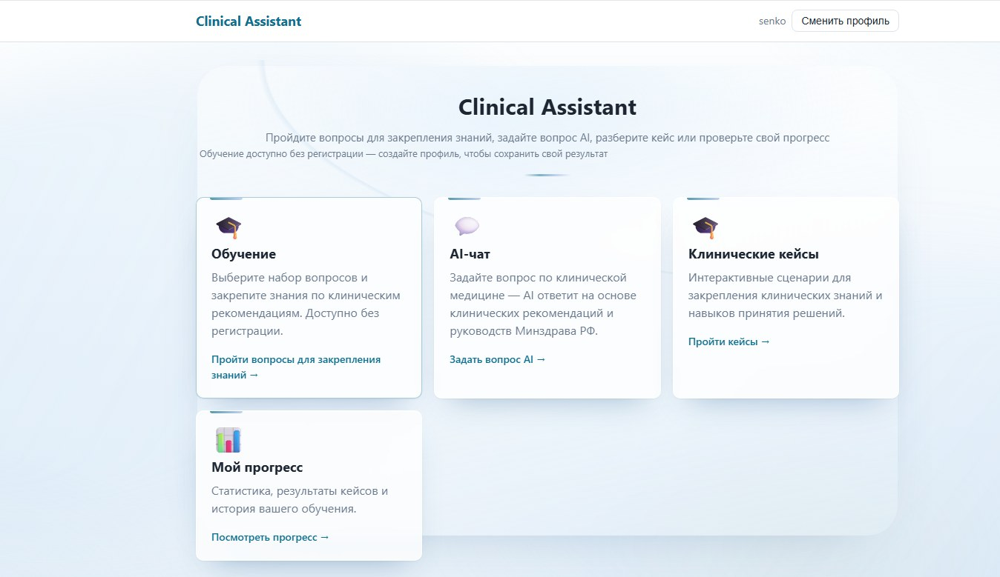
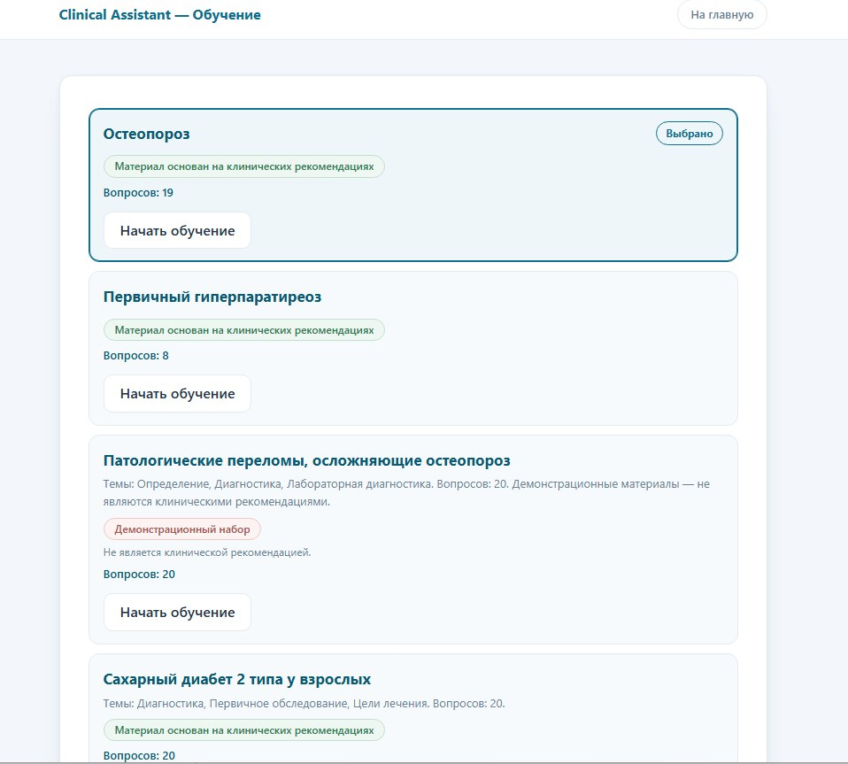
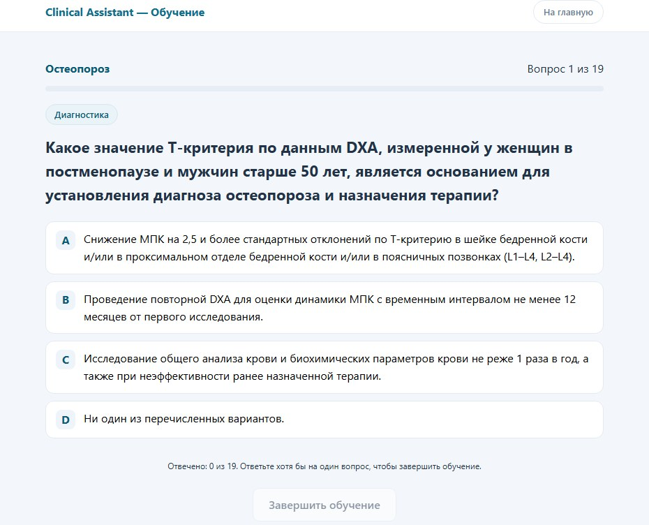
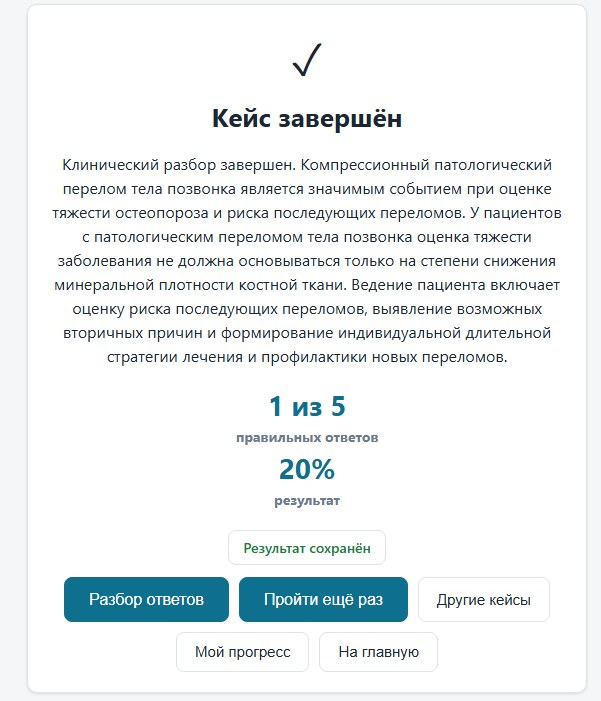
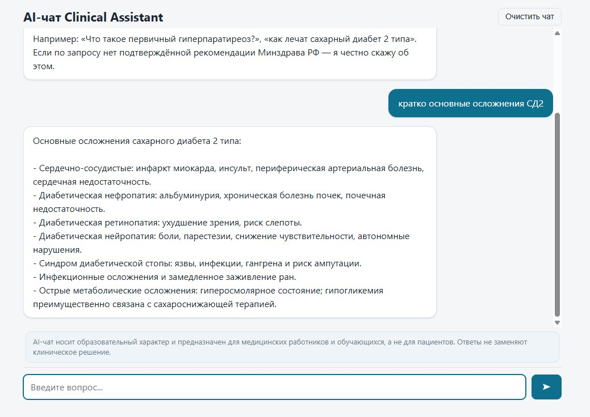
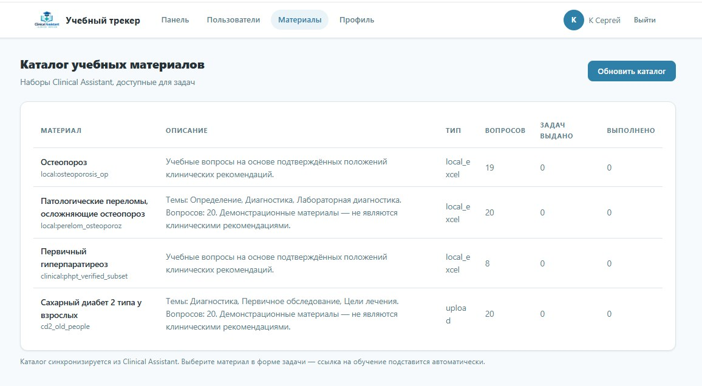

# Clinical Assistant

## Цифровая образовательная система

Clinical Assistant — цифровая образовательная система для обучения, закрепления клинических знаний и контроля учебного прогресса.

Проект объединяет пользовательское обучение, клинические кейсы, AI-чат и отдельный учебный трекер.

---

## Что входит в систему

### Обучение

Пользователь выбирает учебный набор и проходит последовательность вопросов.

В модуле реализованы:

- тематические учебные наборы;
- вопросы с вариантами ответов;
- отображение прогресса;
- автоматический расчёт результата;
- разбор правильных и неправильных ответов;
- объяснения и ссылки на источники;
- повторное прохождение всего набора;
- повторное прохождение только неправильных вопросов.

---

### Клинические кейсы

Интерактивные клинические сценарии для закрепления знаний и навыков принятия решений.

Доступны:

- различные клинические темы;
- уровни сложности — базовый, средний и продвинутый;
- рекомендуемые кейсы;
- итоговая оценка;
- разбор ответов;
- повторное прохождение;
- переход к другим кейсам.

---

### AI-чат

AI-интерфейс для образовательных вопросов по клинической тематике.

Чат предназначен для медицинских работников и обучающихся и имеет явно обозначенное образовательное назначение.

В интерфейсе предусмотрено информирование пользователя о случаях, когда по запросу нет подтверждённой рекомендации Минздрава РФ.

---

### Учебный трекер

Отдельная административная система для организации обучения.

Возможности:

- управление пользователями;
- каталог учебных материалов;
- создание и управление учебными наборами;
- добавление вопросов из Excel;
- назначение учебных задач;
- контроль выполнения;
- отслеживание прогресса;
- контроль сроков;
- индивидуальные страницы учащихся.

Tracker связан с учебными материалами Clinical Assistant и используется для организации учебного процесса.

---

## Web + Windows Offline

Clinical Assistant доступен как веб-версия.

Для модуля «Обучение» также создано отдельное приложение для Windows.

Приложение можно скачать непосредственно из раздела «Обучение» и использовать для локального прохождения учебного модуля без подключения к интернету.

Таким образом, образовательный сценарий поддерживает как онлайн-, так и локальный формат работы.

### Демонстрация

- 🌐 [Веб-версия Clinical Assistant](https://class.metodsk.ru)
- 📊 [Учебный трекер](https://tracker.class.metodsk.ru)
- 🖥️ **Windows-приложение** — [скачать ClinicalAssistant.exe](https://github.com/MetodSK/clinical-assistant/releases/latest)
  - офлайн-прохождение модуля «Обучение»;
  - работает без подключения к интернету.

### Интерфейс системы

#### Главная Clinical Assistant



#### Учебные модули



#### Прохождение обучения



#### Результат клинического кейса



#### AI-чат



#### Учебный трекер



---
---

## Основной учебный сценарий

```text
Выбор темы
    ↓
Прохождение вопросов
    ↓
Результат
    ↓
Разбор ответов
    ↓
Повторное обучение
